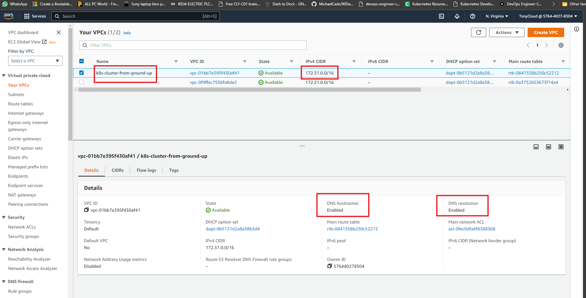
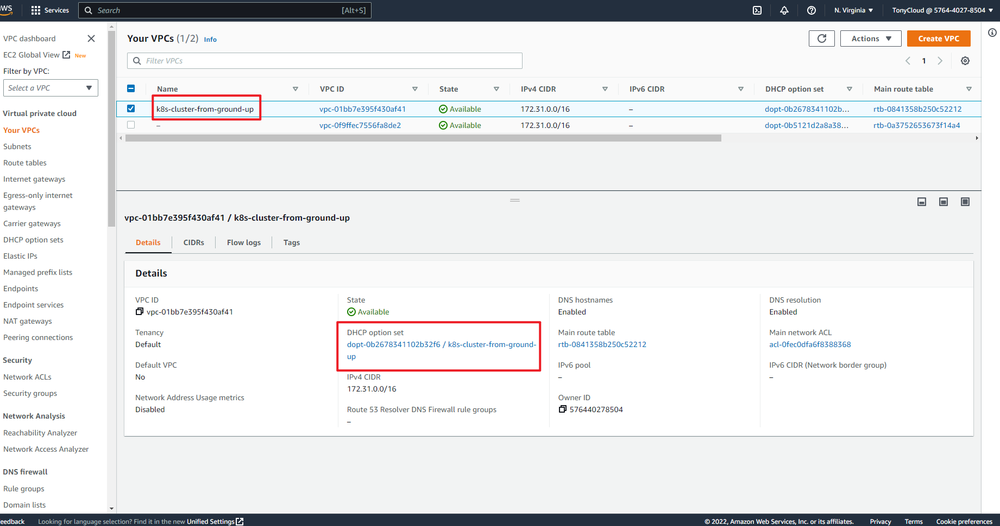

# **ORCHESTRATING CONTAINERS ACROSS MULTIPLE VIRTUAL SERVERS WITH KUBERNETES. PART 1**

# "Kubernetes From-Ground-Up"

K8s installation options

To successfully implement "K8s From-Ground-Up", the following and even more will be done by you as a K8s administrator:

1. Install and configure master (also known as control plane) components and worker nodes (or just nodes).

2. Apply security settings across the entire cluster (i.e., encrypting the data in transit, and at rest)

    In transit encryption means encrypting communications over the network using HTTPS

    At rest encryption means encrypting the data stored on a disk

3.  Plan the capacity for the backend data store etcd

4. Configure network plugins for the containers to communicate

5. Manage periodical upgrade of the cluster

6. Configure observability and auditing

Note: Unless you have any business or compliance restrictions, ALWAYS consider to use managed versions of K8s – Platform as a Service offerings, such as Azure Kubernetes Service (AKS), Amazon Elastic Kubernetes Service (Amazon EKS), or Google Kubernetes Engine (GKE) as they usually have better default security settings, and the costs for maintaining the control plane are very low.


Let us begin building out Kubernetes cluster from the ground

DISCLAIMER: The following setup of Kubernetes should be used for learning purpose only, and not to be considered for production. This is because setting up a K8s cluster for production use has a lot more moving parts, especially when it comes to planning the nodes, and securing the cluster. The purpose of "K8s From-Ground-Up" is to get you much closer to the different components as shown in the architecture diagram and relate with what you have been learning about Kubernetes.

Tools to be used and expected result of the Project 20

1. VM: AWS EC2
2. OS: Ubuntu 20.04 lts+
3. Docker Engine
4. kubectl console utility
5. cfssl and cfssljson utilities
6. Kubernetes cluster

You will create 3 EC2 Instances, and in the end, we will have the following parts of the cluster properly configured:

- One Kubernetes Master
- Two Kubernetes Worker Nodes
- Configured SSL/TLS certificates for Kubernetes components to communicate securely
- Configured Node Network
- Configured Pod Network


# **STEP 0-INSTALL CLIENT TOOLS BEFORE BOOTSTRAPPING THE CLUSTER**

First, you will need some client tools installed and configurations made on your client workstation:

- awscli – is a unified tool to manage your AWS services

- kubectl – this command line utility will be your main control tool to manage your K8s cluster. You will use this tool so many times, so you will be able to type ‘kubetcl’ on your keyboard with a speed of light. You can always make a shortcut (alias) to just one character ‘k’. Also, add this extremely useful official kubectl Cheat Sheet to your bookmarks, it has examples of the most used ‘kubectl’ commands.

- cfssl – an open source toolkit for everything TLS/SSL from Cloudflare

- cfssljson – a program, which takes the JSON output from the cfssl and writes certificates, keys, CSRs, and bundles to disk.

## Install and configure AWS CLI

Configure AWS CLI to access all AWS services used, for this you need to have a user with programmatic access keys configured in AWS Identity and Access Management (IAM):


Test your AWS CLI by running:

`aws ec2 describe-vpcs`


## Installing kubectl

Kubernetes cluster has a Web API that can receive HTTP/HTTPS requests, but it is quite cumbersome to curl an API each and every time you need to send some command, so kubectl command tool was developed to ease a K8s administrator’s life.

With this tool you can easily interact with Kubernetes to deploy applications, inspect and manage cluster resources, view logs and perform many more administrative operations.


```
Download the binary

wget https://storage.googleapis.com/kubernetes-release/release/v1.21.0/bin/linux/amd64/kubectl

Make it executable

chmod +x kubectl
Move to the Bin directory

sudo mv kubectl /usr/local/bin/
Verify that kubectl version 1.21.0 or higher is installed:

kubectl version --client
```


## Install CFSSL and CFSSLJSON


cfssl is an open source tool by Cloudflare used to setup a Public Key Infrastructure (PKI Infrastructure) for generating, signing and bundling TLS certificates. In previous projects you have experienced the use of Letsencrypt for the similar use case. Here, cfssl will be configured as a Certificate Authority which will issue the certificates required to spin up a Kubernetes cluster.

```
wget -q --show-progress --https-only --timestamping \
  https://storage.googleapis.com/kubernetes-the-hard-way/cfssl/1.4.1/linux/cfssl \
  https://storage.googleapis.com/kubernetes-the-hard-way/cfssl/1.4.1/linux/cfssljson

chmod +x cfssl cfssljson

sudo mv cfssl cfssljson /usr/local/bin/
```

# AWS CLOUD RESOURCES FOR KUBERNETES CLUSTER

### Step 1 – Configure Network Infrastructure

Virtual Private Cloud – VPC

1. Create a directory named `k8s-cluster-from-ground-up`

2. Create a VPC and store the ID as a variable:
```
VPC_ID=$(aws ec2 create-vpc \
--cidr-block 172.31.0.0/16 \
--output text --query 'Vpc.VpcId'
)
```
3. Tag the VPC so that it is named:
```
NAME=k8s-cluster-from-ground-up

aws ec2 create-tags \
  --resources ${VPC_ID} \
  --tags Key=Name,Value=${NAME}
```
**Domain Name System – DNS**

4. Enable DNS support for your VPC:
```
aws ec2 modify-vpc-attribute \
--vpc-id ${VPC_ID} \
--enable-dns-support '{"Value": true}'
```
5. Enable DNS support for hostnames:

```
aws ec2 modify-vpc-attribute \
--vpc-id ${VPC_ID} \
--enable-dns-hostnames '{"Value": true}'
```



AWS Region

6. Set the required region
   
`AWS_REGION=eu-central-1`

Dynamic Host Configuration Protocol – DHCP

7. Configure DHCP Options Set: 
```
DHCP_OPTION_SET_ID=$(aws ec2 create-dhcp-options \
  --dhcp-configuration \
    "Key=domain-name,Values=$AWS_REGION.compute.internal" \
    "Key=domain-name-servers,Values=AmazonProvidedDNS" \
  --output text --query 'DhcpOptions.DhcpOptionsId')
```


8. Tag the DHCP Option set:
```
aws ec2 create-tags \
  --resources ${DHCP_OPTION_SET_ID} \
  --tags Key=Name,Value=${NAME}
```

9. Associate the DHCP Option set with the VPC:
```
aws ec2 associate-dhcp-options \
  --dhcp-options-id ${DHCP_OPTION_SET_ID} \
  --vpc-id ${VPC_ID}
```


10. Create the Subnet:
```
SUBNET_ID=$(aws ec2 create-subnet \
  --vpc-id ${VPC_ID} \
  --cidr-block 172.31.0.0/24 \
  --output text --query 'Subnet.SubnetId')
```
```
aws ec2 create-tags \
  --resources ${SUBNET_ID} \
  --tags Key=Name,Value=${NAME}
```


Internet Gateway – IGW

11. Create the Internet Gateway and attach it to the VPC:
```
INTERNET_GATEWAY_ID=$(aws ec2 create-internet-gateway \
  --output text --query 'InternetGateway.InternetGatewayId')
aws ec2 create-tags \
  --resources ${INTERNET_GATEWAY_ID} \
  --tags Key=Name,Value=${NAME}
```
```
aws ec2 attach-internet-gateway \
  --internet-gateway-id ${INTERNET_GATEWAY_ID} \
  --vpc-id ${VPC_ID}
```

Route tables

12. Create route tables, associate the route table to subnet, and create a route to allow external traffic to the Internet through the Internet Gateway:

```
ROUTE_TABLE_ID=$(aws ec2 create-route-table \
  --vpc-id ${VPC_ID} \
  --output text --query 'RouteTable.RouteTableId')
aws ec2 create-tags \
  --resources ${ROUTE_TABLE_ID} \
  --tags Key=Name,Value=${NAME}
aws ec2 associate-route-table \
  --route-table-id ${ROUTE_TABLE_ID} \
  --subnet-id ${SUBNET_ID}
aws ec2 create-route \
  --route-table-id ${ROUTE_TABLE_ID} \
  --destination-cidr-block 0.0.0.0/0 \
  --gateway-id ${INTERNET_GATEWAY_ID}
```
